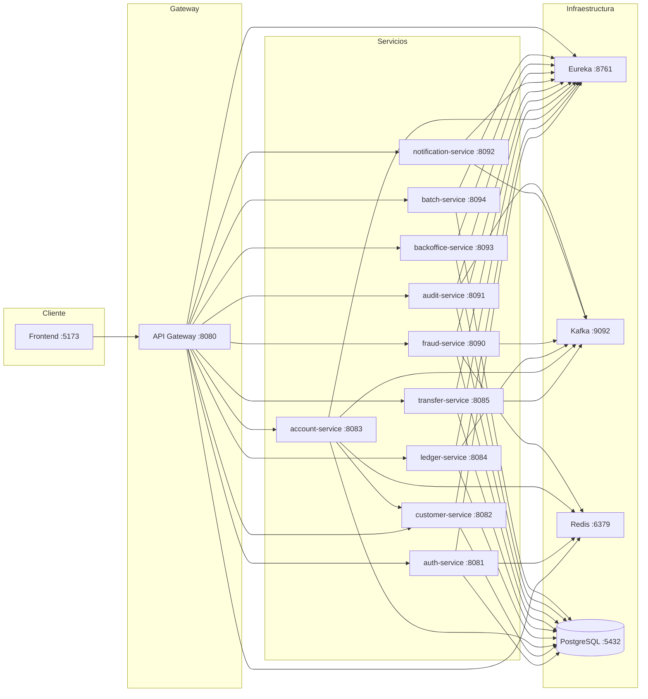

# FinCore Banking System

Sistema bancario moderno desarrollado con microservicios, diseñado para demostrar arquitectura empresarial con patrones de diseño avanzados.

## 🏗️ Arquitectura

```
fincore/
├── eureka-server/           # Servidor de descubrimiento (Netflix Eureka)
├── api-gateway/             # Gateway principal (Spring Cloud Gateway)
├── auth-service/            # Autenticación y autorización (JWT)
├── customer-service/        # Gestión de clientes
├── account-service/         # Gestión de cuentas y saldos
├── ledger-service/          # Contabilidad (doble partida)
├── transfer-service/        # Transferencias con Saga Pattern (12 pasos)
├── fraud-service/           # Motor de reglas antifraude (10 reglas)
├── notification-service/    # Notificaciones (Email, Push, WebSocket)
├── audit-service/           # Trazabilidad y auditoría
├── backoffice-service/      # Panel administrativo
├── batch-service/           # Jobs programados
└── frontend/                # Aplicación web (React + Vite + Tailwind)
```

### Diagrama de conexiones



## 🛠️ Stack Tecnológico

### Backend
- **Java 21** con virtual threads
- **Spring Boot 3.2.5** + Spring Cloud 2023.0.0
- **gRPC** para comunicación inter-servicios
- **Kafka** para eventos asíncronos
- **PostgreSQL** con Flyway migrations
- **Redis** para caché
- **Docker** para contenedores

### Frontend
- **React 18** + **Vite 5**
- **TypeScript** para tipado fuerte
- **Tailwind CSS 3** para estilos
- **Framer Motion** para animaciones
- **Recharts** para gráficos
- **@tabler/icons-react** para iconografía
- **@tremor/react** para componentes de dashboard
- **react-hot-toast** para notificaciones

## 🚀 Inicio Rápido

### Prerrequisitos
- Java 21
- Maven 3.9+
- Node.js 18+
- Docker & Docker Compose
- PostgreSQL (o usar Docker)

### 1. Clonar el repositorio
```bash
git clone https://github.com/abegomez/fincore.git
cd fincore
```

### 2. Configurar base de datos

El proyecto incluye **datos semilla automáticos** en `customer-service` y `account-service`. Al iniciar por primera vez, se cargan automáticamente:

- 2 clientes de prueba (`abel.gomez@fincore.com`, `maria.lopez@fincore.com`)
- 2 cuentas con saldos iniciales (`202600000001` → $1,000, `202600000002` → $500)

No es necesario ejecutar `scripts/seed-data.sql` manualmente a menos que quieras resetear los datos.
```bash
# Levantar PostgreSQL con Docker
docker run -d \
  --name postgres-fincore \
  -e POSTGRES_USER=fincore \
  -e POSTGRES_PASSWORD=fincore123 \
  -p 5432:5432 \
  postgres:16-alpine
```

### 3. Compilar backend
```bash
# Instalar parent POM (solo una vez)
mvn install -N -f fincore-parent/pom.xml

# Compilar todos los servicios
mvn compile -DskipTests -f fincore-parent/pom.xml
```

### 4. Iniciar infraestructura
```bash
# Redis
docker run -d --name redis -p 6379:6379 redis:7

# Kafka
docker run -d --name kafka -p 9092:9092 \
  -e KAFKA_NODE_ID=1 \
  -e KAFKA_PROCESS_ROLES=broker,controller \
  apache/kafka:latest
```

### 5. Iniciar microservicios
```bash
# Opción A: Usando docker-compose (recomendado para desarrollo)
docker-compose up -d

# Opción B: Usando el script batch de Windows
arranque-local.bat
```

Los servicios se levantan en:
- **Eureka Server**: http://localhost:8761
- **API Gateway**: http://localhost:8080
- **Auth Service**: http://localhost:8081
- **Customer Service**: http://localhost:8082
- **Account Service**: http://localhost:8083
- **Ledger Service**: http://localhost:8084
- **Transfer Service**: http://localhost:8085
- **Fraud Service**: http://localhost:8090
- **Audit Service**: http://localhost:8091
- **Notification Service**: http://localhost:8092
- **Backoffice Service**: http://localhost:8093
- **Batch Service**: http://localhost:8094
- **Kafka UI**: http://localhost:8080 (opcional)

### 6. Iniciar frontend
```bash
cd frontend
npm install
npm run dev
```

Frontend disponible en: http://localhost:5173

### 7. Acceder al sistema

Usar cualquiera de estas credenciales:

| Usuario | Contraseña | Rol |
|---------|-----------|-----|
| `abel.gomez@fincore.com` | `password123` | CLIENTE |
| `maria.lopez@fincore.com` | `password123` | CLIENTE |
| `supervisor@fincore.com` | `password123` | SUPERVISOR |
| `auditor@fincore.com` | `password123` | AUDITOR |
| `admin@fincore.com` | `password123` | ADMIN |

## 🔄 Cambios Recientes

### 2026-08-07 — Cuenta seleccionada persistente + preview de beneficiario

- **Frontend**: La cuenta seleccionada ahora persiste en `sessionStorage` durante toda la sesión.
- **Frontend**: El origen de transferencia se toma automáticamente de la cuenta seleccionada (solo lectura).
- **Frontend**: En el formulario de transferencia, al escribir el número de cuenta destino y presionar `Enter`, se muestra un preview con nombre del propietario, identificación y tipo de cuenta.
- **Frontend**: El dashboard auto-selecciona la primera cuenta disponible al iniciar sesión.
- **Frontend**: Sidebar incluye selector de cuenta para cambiar la cuenta activa.
- **Backend**: `CuentaResponse` ahora incluye `nombrePropietario` e `identificacionPropietario`.
- **Backend**: `CuentaQueryServiceImpl` enriquece la respuesta consultando `customer-service` vía `RestTemplate`.
- **Backend**: `account-service` expone endpoint público `/api/cuentas/numero/{numero}` para preview de cuenta.
- **Backend**: `customer-service` expone endpoint público `/api/clientes/**` para consulta de datos básicos.
- **Backend**: Se agregó `RestTemplateConfig` en `account-service` para comunicación inter-servicios.
- **Backend**: Se agregó `SecurityConfig` en `account-service` y `customer-service` para rutas públicas.
- **Backend**: Se agregó `DataInitializer` en `account-service` y `customer-service` para datos semilla.
- **Backend**: Se corrigió flag `-parameters` en `fincore-parent/pom.xml` para binding de parámetros en controladores.

## 👥 Roles de Usuario

El sistema maneja 5 roles predefinidos:

| Rol | Descripción | Permisos |
|-----|-------------|----------|
| **CLIENTE** | Usuario final del banco | Realizar transferencias |
| **OPERADOR** | Operador de backoffice | Transferencias, fraude lista negra, acceso backoffice |
| **SUPERVISOR** | Supervisor de operaciones | Revisar/revertir transferencias, bloquear/crear cuentas, fraude, backoffice |
| **AUDITOR** | Auditor del sistema | Consultar auditoría, acceso backoffice |
| **ADMIN** | Administrador | Acceso total a todos los recursos |

## 📋 Características Principales

### Backend
- ✅ **Saga Pattern orquestado** con 12 pasos y transacciones compensatorias
- ✅ **Motor de reglas antifraude** con 10 reglas configurables
- ✅ **Contabilidad de doble partida** (asientos inmutables)
- ✅ **Eventos Kafka** para comunicación asíncrona
- ✅ **gRPC** para comunicación síncrona
- ✅ **REST inter-servicios** para enriquecimiento de datos (`account-service` → `customer-service`)
- ✅ **JWT** con refresh tokens
- ✅ **WebSocket** para notificaciones en tiempo real
- ✅ **Flyway** para migraciones de base de datos
- ✅ **DataInitializer** para datos semilla automáticos
- ✅ **Optimistic Locking** con `@Version`
- ✅ **Endpoints públicos** para preview de cuenta y datos básicos de cliente

### Frontend
- ✅ **Diseño bancario profesional** con Tailwind CSS
- ✅ **Animaciones fluidas** con Framer Motion
- ✅ **Gráficos interactivos** con Recharts y Tremor
- ✅ **Iconografía profesional** con Tabler Icons
- ✅ **Modo claro/oscuro** con persistencia
- ✅ **Notificaciones toast** con react-hot-toast
- ✅ **Responsive design** para móvil y desktop
- ✅ **Loading skeletons** en todos los estados de carga
- ✅ **Tablas expandibles** con animaciones
- ✅ **Cuenta seleccionada persistente** en `sessionStorage` durante la sesión
- ✅ **Selector de cuenta** en sidebar para cambiar la cuenta activa
- ✅ **Origen de transferencia automático** desde la cuenta seleccionada (solo lectura)
- ✅ **Preview de beneficiario** al escribir número de cuenta destino y presionar `Enter`

## 🗂️ Estructura de Logs

Los logs se guardan en el directorio `logs/` de cada microservicio:

```
fincore/
├── eureka-server/logs/eureka.log
├── api-gateway/logs/api-gateway.log
├── auth-service/logs/auth-service.log
├── account-service/logs/account-service.log
├── transfer-service/logs/transfer-service.log
└── ...
```

**No** se generan logs en la raíz del proyecto.

## 🧪 Testing

```bash
# Tests unitarios por servicio
mvn test -f transfer-service/pom.xml
mvn test -f fraud-service/pom.xml
mvn test -f notification-service/pom.xml
mvn test -f audit-service/pom.xml
mvn test -f backoffice-service/pom.xml
mvn test -f batch-service/pom.xml
```

## 📦 Build

```bash
# Backend
mvn clean package -DskipTests -f fincore-parent/pom.xml

# Frontend
cd frontend
npm run build
```

## 🐳 Docker

### Contenedores específicos de FinCore

El proyecto usa contenedores Docker con nombres y red exclusivos para no interferir con otros proyectos:

```bash
# Iniciar infraestructura
docker-compose up -d

# Ver logs
docker-compose logs -f

# Detener servicios
docker-compose down

# Detener y eliminar volúmenes (¡cuidado! borra datos)
docker-compose down -v
```

**Servicios en contenedores:**
- `fincore-postgres` — PostgreSQL 16 (puerto 5432)
- `fincore-redis` — Redis 7 (puerto 6379)
- `fincore-zookeeper` — Zookeeper (puerto 2181)
- `fincore-kafka` — Kafka 7.5.0 (puerto 9092)
- `fincore-kafka-ui` — Kafka UI (puerto 8080)

**Red:** `fincore-network` (bridge aislado)

### Levantar microservicios Java

Para desarrollo local, cada microservicio se puede ejecutar individualmente con Maven:

```bash
# Orden recomendado
mvn spring-boot:run -f eureka-server/pom.xml
mvn spring-boot:run -f customer-service/pom.xml
mvn spring-boot:run -f account-service/pom.xml
mvn spring-boot:run -f auth-service/pom.xml
mvn spring-boot:run -f api-gateway/pom.xml
mvn spring-boot:run -f transfer-service/pom.xml
# ... resto de servicios
```

> **Nota:** `account-service` y `customer-service` tienen rutas públicas para preview de cuenta (`/api/cuentas/numero/{numero}`) y datos básicos de cliente (`/api/clientes/**`). El resto de rutas requieren JWT válido.

## 📝 Licencia

Este proyecto es parte de un caso de estudio académico/profesional.

## 👨‍💻 Autor

**Abel Gomez** - Desarrollador Full Stack
