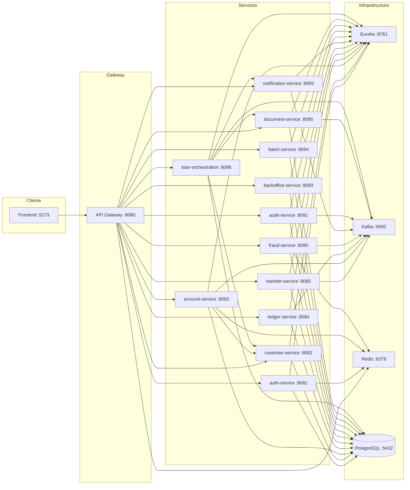

# FinCore Banking System

Sistema bancario moderno desarrollado con microservicios, diseñado para demostrar arquitectura empresarial con patrones de diseño avanzados.

## 🏗️ Arquitectura

```
fincore/
├── eureka-server/              # Servidor de descubrimiento (Netflix Eureka)
├── api-gateway/                # Gateway principal (Spring Cloud Gateway)
├── auth-service/               # Autenticación y autorización (JWT)
├── customer-service/           # Gestión de clientes, KYC, biometría
├── account-service/            # Gestión de cuentas y saldos
├── ledger-service/             # Contabilidad (doble partida)
├── transfer-service/           # Transferencias con Saga Pattern (12 pasos)
├── fraud-service/              # Motor de reglas antifraude (10 reglas)
├── notification-service/       # Notificaciones (Email, Push, WebSocket)
├── audit-service/              # Trazabilidad y auditoría
├── backoffice-service/         # Panel administrativo
├── batch-service/              # Jobs programados
├── document-service/           # Generación de documentos y firma electrónica
├── loan-orchestration/         # Orquestación de préstamos en línea
└── frontend/                   # Aplicación web (React + Vite + Tailwind)
```

### Diagrama de conexiones



## 🗄️ Esquema de Base de Datos

Diagrama relacional completo de todas las tablas por microservicio. Para la documentación detallada, ver [`docs/database-schema.md`](./docs/database-schema.md).

```mermaid
erDiagram
    %% ============================================
    %% AUTH SERVICE
    %% ============================================
    usuarios {
        bigserial id PK
        varchar(255) email UK
        varchar(255) password_hash
        varchar(100) primer_nombre
        varchar(100) segundo_nombre
        varchar(100) primer_apellido
        varchar(100) segundo_apellido
        varchar(20) rol
        varchar(20) estado
        bigint id_cliente FK
        integer intentos_fallidos
        timestamp ultimo_intento_fallido
        timestamp fecha_bloqueo
        timestamp fecha_creacion
        timestamp fecha_actualizacion
        varchar(100) creado_por
        varchar(100) actualizado_por
        bigint version
    }

    refresh_tokens {
        bigserial id PK
        varchar(512) token UK
        bigint id_usuario FK
        timestamp fecha_expiracion
        timestamp fecha_creacion
        timestamp fecha_actualizacion
        timestamp fecha_revocacion
        boolean es_revocado
        varchar(255) device_id
        varchar(45) ip_origen
        text user_agent
        varchar(100) creado_por
        varchar(100) actualizado_por
        bigint version
    }

    sesiones_activas {
        bigserial id PK
        varchar(255) session_id UK
        bigint id_usuario FK
        varchar(255) device_id
        varchar(45) ip_origen
        text user_agent
        timestamp fecha_inicio
        timestamp fecha_creacion
        timestamp fecha_ultima_actividad
        timestamp fecha_expiracion
        timestamp fecha_actualizacion
        boolean es_activa
        varchar(100) creado_por
        varchar(100) actualizado_por
        bigint version
    }

    auditoria_passwords {
        bigserial id PK
        bigint id_usuario FK
        text password_hash_anterior
        text password_hash_nuevo
        varchar(45) ip_origen
        text user_agent
        varchar(255) dispositivo
        text motivo
        timestamp fecha_cambio
        varchar(100) creado_por
        varchar(100) actualizado_por
        bigint version
    }

    auditoria_estados_usuario {
        bigserial id PK
        bigint id_usuario FK
        varchar(20) estado_anterior
        varchar(20) estado_nuevo
        text motivo
        varchar(45) ip_origen
        text user_agent
        varchar(255) dispositivo
        timestamp fecha_cambio
        varchar(100) creado_por
        varchar(100) actualizado_por
        bigint version
    }

    auditoria_passwords {
        bigserial id PK
        bigint id_usuario FK
        varchar(255) password_hash_anterior
        varchar(255) password_hash_nuevo
        varchar(45) ip_origen
        text user_agent
        varchar(255) dispositivo
        timestamp fecha_cambio
        varchar(100) creado_por
        varchar(100) actualizado_por
        bigint version
    }

    auditoria_estados_usuario {
        bigserial id PK
        bigint id_usuario FK
        varchar(20) estado_anterior
        varchar(20) estado_nuevo
        text motivo
        varchar(45) ip_origen
        text user_agent
        varchar(255) dispositivo
        timestamp fecha_cambio
        varchar(100) creado_por
        varchar(100) actualizado_por
        bigint version
    }

    auditoria_passwords {
        bigserial id PK
        bigint id_usuario FK
        text password_hash_anterior
        text password_hash_nuevo
        varchar(45) ip_origen
        text user_agent
        varchar(255) dispositivo
        text motivo
        timestamp fecha_cambio
        varchar(100) creado_por
        varchar(100) actualizado_por
        bigint version
    }

    auditoria_estados_usuario {
        bigserial id PK
        bigint id_usuario FK
        varchar(20) estado_anterior
        varchar(20) estado_nuevo
        text motivo
        varchar(45) ip_origen
        text user_agent
        varchar(255) dispositivo
        timestamp fecha_cambio
        varchar(100) creado_por
        varchar(100) actualizado_por
        bigint version
    }

    roles {
        bigserial id PK
        varchar(50) nombre UK
        text descripcion
        timestamp fecha_creacion
    }

    permisos {
        bigserial id PK
        varchar(100) nombre UK
        text descripcion
        timestamp fecha_creacion
    }

    rol_permisos {
        bigint id_rol PK,FK
        bigint id_permiso PK,FK
    }

    %% ============================================
    %% CUSTOMER SERVICE
    %% ============================================
    clientes {
        bigserial id PK
        varchar(20) tipo_cliente
        varchar(20) estado
        varchar(100) primer_nombre
        varchar(100) segundo_nombre
        varchar(100) primer_apellido
        varchar(100) segundo_apellido
        date fecha_nacimiento
        varchar(20) genero
        varchar(255) email UK
        varchar(20) telefono
        text direccion
        varchar(100) ciudad
        varchar(3) pais
        timestamp fecha_registro
        timestamp fecha_actualizacion
        bigint version
    }

    documentos_identidad {
        bigserial id PK
        bigint id_cliente FK
        varchar(20) tipo_documento
        varchar(20) numero_documento
        date fecha_expedicion
        date fecha_expiracion
        varchar(3) pais_emision
        boolean verificado
        timestamp fecha_verificacion
        timestamp fecha_creacion
    }

    direcciones {
        bigserial id PK
        bigint id_cliente FK
        varchar(20) tipo_direccion
        text calle_principal
        text calle_secundaria
        varchar(100) ciudad
        varchar(100) provincia
        varchar(3) pais
        varchar(20) codigo_postal
        decimal(10,8) latitud
        decimal(11,8) longitud
        timestamp fecha_creacion
    }

    contactos_emergencia {
        bigserial id PK
        bigint id_cliente FK
        varchar(255) nombre
        varchar(20) telefono
        varchar(50) parentesco
        timestamp fecha_creacion
    }

    kyc_verificaciones {
        bigserial id PK
        bigint id_cliente FK
        varchar(20) estado
        timestamp fecha_verificacion
        varchar(100) verificado_por
        text observaciones
        timestamp fecha_creacion
        timestamp fecha_actualizacion
    }

    auditoria_estados_cliente {
        bigserial id PK
        bigint id_cliente FK
        varchar(20) estado_anterior
        varchar(20) estado_nuevo
        text motivo
        varchar(45) ip_origen
        text user_agent
        varchar(255) dispositivo
        timestamp fecha_cambio
        varchar(100) creado_por
        varchar(100) actualizado_por
        bigint version
    }

    auditoria_estados_cliente {
        bigserial id PK
        bigint id_cliente FK
        varchar(20) estado_anterior
        varchar(20) estado_nuevo
        text motivo
        varchar(45) ip_origen
        text user_agent
        varchar(255) dispositivo
        timestamp fecha_cambio
        varchar(100) creado_por
        varchar(100) actualizado_por
        bigint version
    }

    auditoria_estados_cliente {
        bigserial id PK
        bigint id_cliente FK
        varchar(20) estado_anterior
        varchar(20) estado_nuevo
        text motivo
        varchar(45) ip_origen
        text user_agent
        varchar(255) dispositivo
        timestamp fecha_cambio
        varchar(100) creado_por
        varchar(100) actualizado_por
        bigint version
    }

    %% ============================================
    %% ACCOUNT SERVICE
    %% ============================================
    tipos_cuenta {
        bigserial id PK
        varchar(10) codigo UK
        varchar(100) nombre
        text descripcion
        decimal(8,4) tasa_interes_anual
        decimal(18,2) saldo_minimo
        decimal(18,2) limite_transaccion_diario
        decimal(18,2) limite_monto_por_transaccion
        boolean permite_sobregiro
        timestamp fecha_creacion
    }

    cuentas {
        bigserial id PK
        varchar(20) numero_cuenta UK
        bigint id_cliente
        bigint id_tipo_cuenta FK
        varchar(20) estado
        varchar(3) moneda
        decimal(18,2) saldo_contable
        decimal(18,2) saldo_disponible
        decimal(18,2) saldo_retenido
        decimal(18,2) saldo_proyectado
        text motivo_bloqueo
        date fecha_apertura
        timestamp fecha_ultimo_movimiento
        date fecha_cierre
        bigint version
        timestamp fecha_creacion
        timestamp fecha_actualizacion
    }

    saldos_historicos {
        bigserial id PK
        bigint id_cuenta FK
        date fecha_snapshot
        decimal(18,2) saldo_contable
        decimal(18,2) saldo_disponible
        decimal(18,2) saldo_retenido
        decimal(18,2) saldo_proyectado
        timestamp fecha_creacion
    }

    limites_transaccion {
        bigserial id PK
        bigint id_cuenta FK
        decimal(18,2) monto_maximo_diario
        decimal(18,2) monto_maximo_por_transaccion
        decimal(18,2) monto_maximo_mensual
        decimal(18,2) contador_diario
        decimal(18,2) contador_mensual
        timestamp fecha_ultima_transaccion
        timestamp fecha_creacion
        timestamp fecha_actualizacion
    }

    beneficiarios_frecuentes {
        bigserial id PK
        bigint id_cliente
        bigint id_cuenta_beneficiario FK
        varchar(255) nombre_beneficiario
        varchar(20) numero_cuenta
        boolean activo
        timestamp fecha_creacion
        timestamp fecha_actualizacion
    }

    auditoria_estados_cuenta {
        bigserial id PK
        bigint id_cuenta FK
        varchar(20) estado_anterior
        varchar(20) estado_nuevo
        text motivo
        varchar(45) ip_origen
        text user_agent
        varchar(255) dispositivo
        timestamp fecha_cambio
        varchar(100) creado_por
        varchar(100) actualizado_por
        bigint version
    }

    auditoria_estados_cuenta {
        bigserial id PK
        bigint id_cuenta FK
        varchar(20) estado_anterior
        varchar(20) estado_nuevo
        text motivo
        varchar(45) ip_origen
        text user_agent
        varchar(255) dispositivo
        timestamp fecha_cambio
        varchar(100) creado_por
        varchar(100) actualizado_por
        bigint version
    }

    auditoria_estados_cuenta {
        bigserial id PK
        bigint id_cuenta FK
        varchar(20) estado_anterior
        varchar(20) estado_nuevo
        text motivo
        varchar(45) ip_origen
        text user_agent
        varchar(255) dispositivo
        timestamp fecha_cambio
        varchar(100) creado_por
        varchar(100) actualizado_por
        bigint version
    }

    %% ============================================
    %% TRANSFER SERVICE
    %% ============================================
    transferencias {
        bigserial id PK
        varchar(30) numero_transferencia UK
        bigint id_cuenta_origen
        varchar(20) numero_cuenta_origen
        bigint id_cuenta_destino
        varchar(20) numero_cuenta_destino
        varchar(255) nombre_beneficiario
        decimal(18,2) monto
        varchar(3) moneda
        decimal(18,2) comision
        text concepto
        varchar(20) estado
        varchar(50) paso_saga_actual
        integer intentos_saga
        integer score_fraude
        varchar(20) decision_fraude
        varchar(100) id_usuario
        varchar(45) ip_origen
        varchar(255) dispositivo
        varchar(100) trace_id
        timestamp fecha_iniciada
        timestamp fecha_completada
        timestamp fecha_revertida
        text motivo_rechazo
        bigint version
        timestamp fecha_creacion
        timestamp fecha_actualizacion
    }

    transferencia_estados {
        bigserial id PK
        bigint id_transferencia FK
        varchar(20) estado_anterior
        varchar(20) estado_nuevo
        varchar(50) paso_saga
        text descripcion
        text error_detalle
        timestamp fecha_cambio
    }

    saga_log {
        bigserial id PK
        bigint id_transferencia FK
        varchar(50) paso_saga
        integer orden
        varchar(20) estado_ejecucion
        text detalle
        text error_detalle
        integer tiempo_ejecucion_ms
        timestamp fecha_ejecucion
    }

    compensating_transactions_log {
        bigserial id PK
        bigint id_transferencia FK
        varchar(50) paso_original
        varchar(50) paso_compensacion
        varchar(20) estado_ejecucion
        text detalle
        text error_detalle
        timestamp fecha_ejecucion
    }

    auditoria_transferencias {
        bigserial id PK
        bigint id_transferencia FK
        varchar(50) accion
        varchar(20) estado_anterior
        varchar(20) estado_nuevo
        varchar(20) resultado
        text detalle
        text error_detalle
        varchar(100) id_usuario
        varchar(45) ip_origen
        varchar(255) dispositivo
        varchar(100) trace_id
        timestamp fecha_accion
        varchar(100) creado_por
        varchar(100) actualizado_por
        bigint version
    }

    auditoria_transferencias {
        bigserial id PK
        bigint id_transferencia FK
        varchar(50) accion
        varchar(20) estado_anterior
        varchar(20) estado_nuevo
        varchar(20) resultado
        text detalle
        text error_detalle
        varchar(100) id_usuario
        varchar(45) ip_origen
        varchar(255) dispositivo
        varchar(100) trace_id
        timestamp fecha_accion
        varchar(100) creado_por
        varchar(100) actualizado_por
        bigint version
    }

    auditoria_transferencias {
        bigserial id PK
        bigint id_transferencia FK
        varchar(50) accion
        varchar(20) estado_anterior
        varchar(20) estado_nuevo
        varchar(20) resultado
        text detalle
        text error_detalle
        varchar(100) id_usuario
        varchar(45) ip_origen
        varchar(255) dispositivo
        varchar(100) trace_id
        timestamp fecha_accion
        varchar(100) creado_por
        varchar(100) actualizado_por
        bigint version
    }

    %% ============================================
    %% LEDGER SERVICE
    %% ============================================
    plan_cuentas {
        bigserial id PK
        varchar(10) codigo UK
        varchar(200) nombre
        varchar(20) tipo
        varchar(10) naturaleza
        integer nivel
        varchar(10) codigo_padre
        boolean es_hoja
        boolean es_activa
        timestamp fecha_creacion
        varchar(255) creado_por
    }

    asientos_contables {
        bigserial id PK
        varchar(30) numero_asiento UK
        text descripcion
        bigint id_referencia
        varchar(50) tipo_referencia
        varchar(100) id_usuario
        varchar(45) ip_origen
        varchar(100) trace_id
        timestamp fecha_asiento
        varchar(20) estado
        timestamp fecha_creacion
    }

    lineas_asiento {
        bigserial id PK
        bigint id_asiento FK
        varchar(10) codigo_cuenta FK
        bigint id_cuenta_bancaria
        varchar(10) tipo_movimiento
        decimal(18,2) monto
        text descripcion
        timestamp fecha_creacion
    }

    %% ============================================
    %% FRAUD SERVICE
    %% ============================================
    reglas_fraude {
        bigserial id PK
        varchar(50) codigo UK
        varchar(100) nombre
        integer puntos
        jsonb parametros
        boolean es_activo
        timestamp fecha_creacion
        timestamp fecha_actualizacion
    }

    perfil_transaccional {
        bigserial id PK
        bigint id_cliente UK
        decimal(18,2) promedio_monto_30d
        decimal(18,2) maximo_monto_30d
        integer total_transferencias_30d
        jsonb paises_habituales
        jsonb dispositivos_habituales
        jsonb horarios_habituales
        timestamp fecha_actualizacion
    }

    lista_negra {
        bigserial id PK
        varchar(20) tipo
        varchar(255) valor
        varchar(255) motivo
        boolean es_activo
        timestamp fecha_creacion
        timestamp fecha_actualizacion
    }

    evaluaciones_fraude {
        bigserial id PK
        bigint id_transferencia
        bigint id_cliente
        integer score_total
        varchar(20) decision
        jsonb reglas_activadas
        varchar(45) ip_origen
        varchar(255) dispositivo
        integer tiempo_evaluacion_ms
        varchar(100) revisado_por
        timestamp fecha_revision
        timestamp fecha_creacion
    }

    %% ============================================
    %% AUDIT SERVICE
    %% ============================================
    registros_auditoria {
        bigserial id PK
        varchar(100) trace_id
        varchar(50) servicio
        varchar(255) endpoint
        varchar(10) metodo_http
        varchar(100) id_usuario
        varchar(50) rol_usuario
        varchar(45) ip_origen
        varchar(100) id_recurso
        varchar(50) tipo_recurso
        varchar(100) accion
        varchar(20) resultado
        text request_body
        integer response_codigo
        integer tiempo_respuesta_ms
        text detalle
        timestamp fecha_creacion
    }

    eventos_saga {
        bigserial id PK
        bigint id_transferencia
        varchar(50) numero_transferencia
        varchar(50) paso_saga
        integer orden
        varchar(20) estado_ejecucion
        text detalle
        text error_detalle
        integer duracion_ms
        timestamp fecha_creacion
    }

    %% ============================================
    %% BACKOFFICE SERVICE
    %% ============================================
    usuarios_sistema {
        bigserial id PK
        varchar(50) username UK
        varchar(255) password_hash
        varchar(100) nombre_completo
        varchar(100) email
        jsonb roles
        varchar(20) estado
        timestamp fecha_creacion
        timestamp fecha_actualizacion
    }

    auditorias_sistema {
        bigserial id PK
        varchar(100) id_usuario_sistema
        varchar(100) accion
        varchar(50) entidad
        varchar(100) id_entidad
        text detalle
        varchar(45) ip_origen
        timestamp fecha_creacion
    }

    configuracion_fraude {
        bigserial id PK
        varchar(100) codigo_variable UK
        text valor
        text descripcion
        varchar(20) tipo
        timestamp fecha_actualizacion
    }

    auditoria_cambios_backoffice {
        bigserial id PK
        bigint id_usuario_sistema FK
        varchar(50) entidad
        varchar(100) id_entidad
        varchar(100) accion
        jsonb valores_anteriores
        jsonb valores_nuevos
        text comentario
        varchar(45) ip_origen
        text user_agent
        varchar(255) dispositivo
        timestamp fecha_cambio
        varchar(100) creado_por
        varchar(100) actualizado_por
        bigint version
    }

    auditoria_cambios_backoffice {
        bigserial id PK
        bigint id_usuario_sistema FK
        varchar(50) entidad
        varchar(100) id_entidad
        varchar(100) accion
        jsonb valores_anteriores
        jsonb valores_nuevos
        varchar(45) ip_origen
        text user_agent
        varchar(255) dispositivo
        timestamp fecha_cambio
        varchar(100) creado_por
        varchar(100) actualizado_por
        bigint version
    }

    %% ============================================
    %% BATCH SERVICE
    %% ============================================
    jobs_ejecutados {
        bigserial id PK
        varchar(100) nombre_job
        timestamp fecha_inicio
        timestamp fecha_fin
        varchar(20) estado
        integer registros_procesados
        text detalle
        text error_detalle
        timestamp fecha_creacion
    }

    conciliaciones {
        bigserial id PK
        date fecha_procesamiento
        integer total_transferencias
        decimal(18,2) total_debitos
        decimal(18,2) total_creditos
        jsonb diferencias
        varchar(20) estado
        timestamp fecha_creacion
    }

    auditoria_cambios_backoffice {
        bigserial id PK
        bigint id_usuario_sistema FK
        varchar(50) entidad
        varchar(100) id_entidad
        varchar(100) accion
        jsonb valores_anteriores
        jsonb valores_nuevos
        text comentario
        varchar(45) ip_origen
        text user_agent
        varchar(255) dispositivo
        timestamp fecha_cambio
        varchar(100) creado_por
        varchar(100) actualizado_por
        bigint version
    }

    %% ============================================
    %% NOTIFICATION SERVICE
    %% ============================================
    notificaciones {
        bigserial id PK
        varchar(50) tipo_notificacion
        varchar(100) id_usuario
        bigint id_transferencia
        varchar(50) numero_transferencia
        varchar(20) canal
        varchar(20) estado
        varchar(255) titulo
        text mensaje
        jsonb datos_adicionales
        timestamp fecha_envio
        timestamp fecha_creacion
        timestamp fecha_actualizacion
    }

    %% ============================================
    %% RELATIONSHIPS
    %% ============================================
    usuarios ||--o{ refresh_tokens : "tiene"
    usuarios ||--o{ sesiones_activas : "tiene"
    usuarios ||--o{ auditoria_passwords : "tiene"
    usuarios ||--o{ auditoria_estados_usuario : "tiene"
    roles ||--o{ rol_permisos : "tiene"
    permisos ||--o{ rol_permisos : "tiene"

    clientes ||--o{ documentos_identidad : "tiene"
    clientes ||--o{ direcciones : "tiene"
    clientes ||--o{ contactos_emergencia : "tiene"
    clientes ||--o{ kyc_verificaciones : "tiene"
    clientes ||--o{ auditoria_estados_cliente : "tiene"

    tipos_cuenta ||--o{ cuentas : "tiene"
    cuentas ||--o{ saldos_historicos : "tiene"
    cuentas ||--o{ limites_transaccion : "tiene"
    cuentas ||--o{ beneficiarios_frecuentes : "beneficiario"
    cuentas ||--o{ auditoria_estados_cuenta : "tiene"

    transferencias ||--o{ transferencia_estados : "tiene"
    transferencias ||--o{ saga_log : "tiene"
    transferencias ||--o{ compensating_transactions_log : "tiene"
    transferencias ||--o{ auditoria_transferencias : "tiene"
    transferencias ||--o{ notificaciones : "genera"

    asientos_contables ||--o{ lineas_asiento : "tiene"
    plan_cuentas ||--o{ lineas_asiento : "tiene"
    usuarios_sistema ||--o{ auditoria_cambios_backoffice : "tiene"
```

## 🛠️ Stack Tecnológico

### Backend
- **Java 21** con virtual threads
- **Spring Boot 3.2.5** + Spring Cloud 2023.0.0
- **gRPC** para comunicación inter-servicios
- **Kafka** para eventos asíncronos
- **PostgreSQL** con Flyway migrations
- **Redis** para caché
- **Docker** para contenedores

### Frontend
- **React 18** + **Vite 5**
- **TypeScript** para tipado fuerte
- **Tailwind CSS 3** para estilos
- **Framer Motion** para animaciones
- **Recharts** para gráficos
- **@tabler/icons-react** para iconografía
- **@tremor/react** para componentes de dashboard
- **react-hot-toast** para notificaciones

## 🚀 Inicio Rápido

### Prerrequisitos
- Java 21
- Maven 3.9+
- Node.js 18+
- Docker & Docker Compose
- PostgreSQL (o usar Docker)

### 1. Clonar el repositorio
```bash
git clone https://github.com/abegomez/fincore.git
cd fincore
```

### 2. Configurar base de datos

El proyecto incluye **datos semilla automáticos** en `customer-service` y `account-service`. Al iniciar por primera vez, se cargan automáticamente:

- 2 clientes de prueba (`abel.gomez@fincore.com`, `maria.lopez@fincore.com`)
- 2 cuentas con saldos iniciales (`202600000001` → $1,000, `202600000002` → $500)

No es necesario ejecutar `scripts/seed-data.sql` manualmente a menos que quieras resetear los datos.
```bash
# Levantar PostgreSQL con Docker
docker run -d \
  --name postgres-fincore \
  -e POSTGRES_USER=fincore \
  -e POSTGRES_PASSWORD=fincore123 \
  -p 5432:5432 \
  postgres:16-alpine
```

### 3. Compilar backend
```bash
# Instalar parent POM (solo una vez)
mvn install -N -f fincore-parent/pom.xml

# Compilar todos los servicios
mvn compile -DskipTests -f fincore-parent/pom.xml
```

### 4. Iniciar infraestructura
```bash
# Redis
docker run -d --name redis -p 6379:6379 redis:7

# Kafka
docker run -d --name kafka -p 9092:9092 \
  -e KAFKA_NODE_ID=1 \
  -e KAFKA_PROCESS_ROLES=broker,controller \
  apache/kafka:latest
```

### 5. Iniciar microservicios
```bash
# Opción A: Usando docker-compose (recomendado para desarrollo)
docker-compose up -d

# Opción B: Usando el script batch de Windows
arranque-local.bat
```

Los servicios se levantan en:
- **Eureka Server**: http://localhost:8761
- **API Gateway**: http://localhost:8080
- **Auth Service**: http://localhost:8081
- **Customer Service**: http://localhost:8082
- **Account Service**: http://localhost:8083
- **Ledger Service**: http://localhost:8084
- **Transfer Service**: http://localhost:8085
- **Fraud Service**: http://localhost:8090
- **Audit Service**: http://localhost:8091
- **Notification Service**: http://localhost:8092
- **Backoffice Service**: http://localhost:8093
- **Batch Service**: http://localhost:8094
- **Kafka UI**: http://localhost:8080 (opcional)

### 6. Iniciar frontend
```bash
cd frontend
npm install
npm run dev
```

Frontend disponible en: http://localhost:5173

### 7. Acceder al sistema

Usar cualquiera de estas credenciales:

| Usuario | Contraseña | Rol |
|---------|-----------|-----|
| `abel.gomez@fincore.com` | `password123` | CLIENTE |
| `maria.lopez@fincore.com` | `password123` | CLIENTE |
| `supervisor@fincore.com` | `password123` | SUPERVISOR |
| `auditor@fincore.com` | `password123` | AUDITOR |
| `admin@fincore.com` | `password123` | ADMIN |

## 🔄 Cambios Recientes

### 2026-08-07 — Cuenta seleccionada persistente + preview de beneficiario

- **Frontend**: La cuenta seleccionada ahora persiste en `sessionStorage` durante toda la sesión.
- **Frontend**: El origen de transferencia se toma automáticamente de la cuenta seleccionada (solo lectura).
- **Frontend**: En el formulario de transferencia, al escribir el número de cuenta destino y presionar `Enter`, se muestra un preview con nombre del propietario, identificación y tipo de cuenta.
- **Frontend**: El dashboard auto-selecciona la primera cuenta disponible al iniciar sesión.
- **Frontend**: Sidebar incluye selector de cuenta para cambiar la cuenta activa.
- **Backend**: `CuentaResponse` ahora incluye `nombrePropietario` e `identificacionPropietario`.
- **Backend**: `CuentaQueryServiceImpl` enriquece la respuesta consultando `customer-service` vía `RestTemplate`.
- **Backend**: `account-service` expone endpoint público `/api/cuentas/numero/{numero}` para preview de cuenta.
- **Backend**: `customer-service` expone endpoint público `/api/clientes/**` para consulta de datos básicos.
- **Backend**: Se agregó `RestTemplateConfig` en `account-service` para comunicación inter-servicios.
- **Backend**: Se agregó `SecurityConfig` en `account-service` y `customer-service` para rutas públicas.
- **Backend**: Se agregó `DataInitializer` en `account-service` y `customer-service` para datos semilla.
- **Backend**: Se corrigió flag `-parameters` en `fincore-parent/pom.xml` para binding de parámetros en controladores.

## 👥 Roles de Usuario

El sistema maneja 5 roles predefinidos:

| Rol | Descripción | Permisos |
|-----|-------------|----------|
| **CLIENTE** | Usuario final del banco | Realizar transferencias |
| **OPERADOR** | Operador de backoffice | Transferencias, fraude lista negra, acceso backoffice |
| **SUPERVISOR** | Supervisor de operaciones | Revisar/revertir transferencias, bloquear/crear cuentas, fraude, backoffice |
| **AUDITOR** | Auditor del sistema | Consultar auditoría, acceso backoffice |
| **ADMIN** | Administrador | Acceso total a todos los recursos |

## 📋 Características Principales

### Backend
- ✅ **Saga Pattern orquestado** con 12 pasos y transacciones compensatorias
- ✅ **Motor de reglas antifraude** con 10 reglas configurables
- ✅ **Contabilidad de doble partida** (asientos inmutables)
- ✅ **Eventos Kafka** para comunicación asíncrona
- ✅ **gRPC** para comunicación síncrona
- ✅ **REST inter-servicios** para enriquecimiento de datos (`account-service` → `customer-service`)
- ✅ **JWT** con refresh tokens
- ✅ **WebSocket** para notificaciones en tiempo real
- ✅ **Flyway** para migraciones de base de datos
- ✅ **DataInitializer** para datos semilla automáticos
- ✅ **Optimistic Locking** con `@Version`
- ✅ **Endpoints públicos** para preview de cuenta y datos básicos de cliente

### Frontend
- ✅ **Diseño bancario profesional** con Tailwind CSS
- ✅ **Animaciones fluidas** con Framer Motion
- ✅ **Gráficos interactivos** con Recharts y Tremor
- ✅ **Iconografía profesional** con Tabler Icons
- ✅ **Modo claro/oscuro** con persistencia
- ✅ **Notificaciones toast** con react-hot-toast
- ✅ **Responsive design** para móvil y desktop
- ✅ **Loading skeletons** en todos los estados de carga
- ✅ **Tablas expandibles** con animaciones
- ✅ **Cuenta seleccionada persistente** en `sessionStorage` durante la sesión
- ✅ **Selector de cuenta** en sidebar para cambiar la cuenta activa
- ✅ **Origen de transferencia automático** desde la cuenta seleccionada (solo lectura)
- ✅ **Preview de beneficiario** al escribir número de cuenta destino y presionar `Enter`

## 🗂️ Estructura de Logs

Los logs se guardan en el directorio `logs/` de cada microservicio:

```
fincore/
├── eureka-server/logs/eureka.log
├── api-gateway/logs/api-gateway.log
├── auth-service/logs/auth-service.log
├── account-service/logs/account-service.log
├── transfer-service/logs/transfer-service.log
└── ...
```

**No** se generan logs en la raíz del proyecto.

## 🧪 Testing

```bash
# Tests unitarios por servicio
mvn test -f transfer-service/pom.xml
mvn test -f fraud-service/pom.xml
mvn test -f notification-service/pom.xml
mvn test -f audit-service/pom.xml
mvn test -f backoffice-service/pom.xml
mvn test -f batch-service/pom.xml
```

## 🧾 Auditoría

El sistema registra auditoría especializada por entidad y por flujo. En el backoffice se puede consultar desde el modal de auditoría con pestañas para estados y contraseñas.

### Tablas de auditoría

| Tabla | Entidad | Comentario / detalle |
|------|------|------|
| `auditoria_passwords` | Usuario | `motivo` largo |
| `auditoria_estados_usuario` | Usuario | `motivo` largo |
| `auditoria_estados_cliente` | Cliente | `motivo` largo |
| `auditoria_estados_cuenta` | Cuenta | `motivo` largo |
| `auditoria_transferencias` | Transferencia | `detalle` largo |
| `auditoria_cambios_backoffice` | Backoffice | `comentario` largo |

### Endpoints de auditoría

| Método | Endpoint | Descripción |
|--------|----------|-------------|
| GET | `/api/auth/auditoria/{userId}` | Auditoría de estados de usuario |
| GET | `/api/auth/auditoria/passwords/{userId}` | Auditoría de cambios de contraseña |
| GET | `/api/clientes/{id}/auditoria` | Auditoría de estados de cliente |
| GET | `/api/cuentas/{id}/auditoria` | Auditoría de estados de cuenta |
| GET | `/api/v1/transferencias/{id}/auditoria` | Auditoría de transferencias |
| GET | `/api/backoffice/auditoria/usuario/{id}` | Auditoría de cambios backoffice |

### Flujos auditados

- **Auth**: login, registro, refresh, logout-all, cambio de password, cambios de estado, consulta de usuario.
- **Transferencias**: creación, completada, rechazada, revertida.
- **Cuentas**: apertura, bloqueo.
- **Clientes**: bloqueo, desbloqueo, suspensión, reactivación, eliminación.
- **Backoffice**: cambios en usuarios backoffice.
- **Préstamos**: solicitud, validación de identidad, buró de crédito, evaluación de riesgo, generación de contrato, firma electrónica, desembolso.

## 💰 Préstamos en línea

### Flujo de originación

1. **Solicitud** → `loan-orchestration-service`
2. **Validación de identidad / biometría** → `customer-service`
3. **Consulta de buró de crédito** → adaptador dentro de `loan-orchestration-service`
4. **Evaluación de riesgo** → `loan-orchestration-service`
5. **Generación de contrato** → `document-service`
6. **Firma electrónica** → `document-service`
7. **Notificación** → `notification-service`
8. **Desembolso / contabilización** → `ledger-service`

### Roles involucrados

| Rol | Responsabilidad |
|-----|-----------------|
| `CLIENTE` | Solicita préstamo, firma contrato |
| `OPERADOR` | Carga datos, valida identidad |
| `SUPERVISOR` | Aprueba/rechaza préstamos |
| `ADMIN` | Configura reglas, plantillas, proveedores |
| `AUDITOR` | Consulta historial y trazabilidad |

## 📦 Build

```bash
# Backend
mvn clean package -DskipTests -f fincore-parent/pom.xml

# Frontend
cd frontend
npm run build
```

## 🐳 Docker

### Contenedores específicos de FinCore

El proyecto usa contenedores Docker con nombres y red exclusivos para no interferir con otros proyectos:

```bash
# Iniciar infraestructura
docker-compose up -d

# Ver logs
docker-compose logs -f

# Detener servicios
docker-compose down

# Detener y eliminar volúmenes (¡cuidado! borra datos)
docker-compose down -v
```

**Servicios en contenedores:**
- `fincore-postgres` — PostgreSQL 16 (puerto 5432)
- `fincore-redis` — Redis 7 (puerto 6379)
- `fincore-zookeeper` — Zookeeper (puerto 2181)
- `fincore-kafka` — Kafka 7.5.0 (puerto 9092)
- `fincore-kafka-ui` — Kafka UI (puerto 8080)

**Red:** `fincore-network` (bridge aislado)

### Levantar microservicios Java

Para desarrollo local, cada microservicio se puede ejecutar individualmente con Maven:

```bash
# Orden recomendado
mvn spring-boot:run -f eureka-server/pom.xml
mvn spring-boot:run -f customer-service/pom.xml
mvn spring-boot:run -f account-service/pom.xml
mvn spring-boot:run -f auth-service/pom.xml
mvn spring-boot:run -f api-gateway/pom.xml
mvn spring-boot:run -f transfer-service/pom.xml
# ... resto de servicios
```

> **Nota:** `account-service` y `customer-service` tienen rutas públicas para preview de cuenta (`/api/cuentas/numero/{numero}`) y datos básicos de cliente (`/api/clientes/**`). El resto de rutas requieren JWT válido.

## 📝 Licencia

Este proyecto es parte de un caso de estudio académico/profesional.

## 👨‍💻 Autor

**Abel Gomez** - Desarrollador Full Stack
